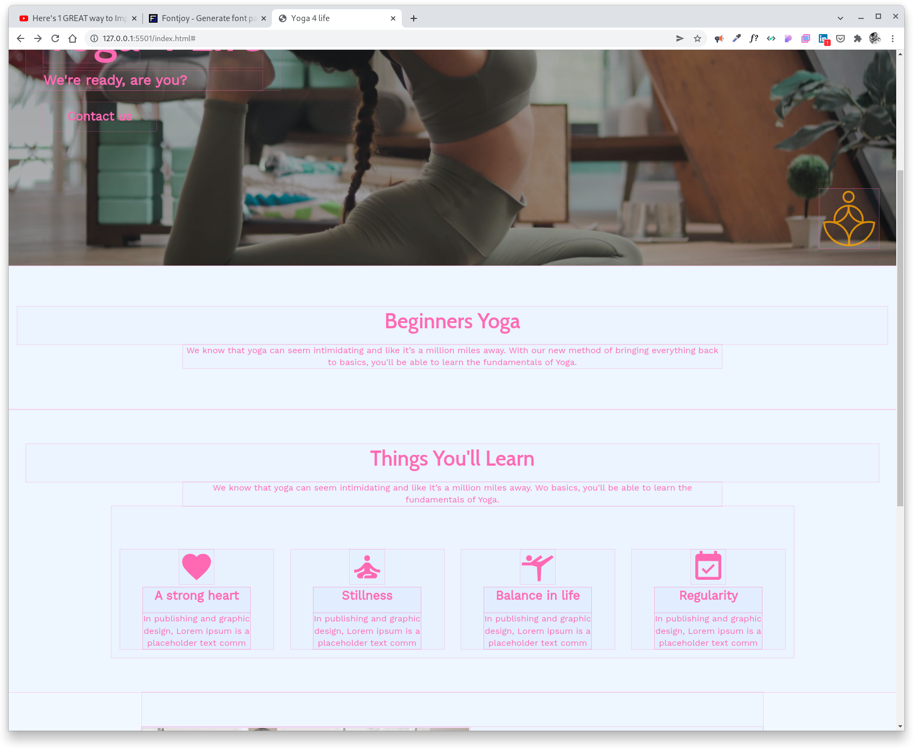

# Project one - *Yoga 4 Life*

Site url: <https://dmcginley.github.io/project1_yoga_site/>

Repository for the project: <https://github.com/dmcginley/project1_yoga_site>

## Table of contents

  - [Wireframe](#wireframe)
  - [Style Guide](#style-guide)
  - [References Section](#references-section)
  - [Testing](#testing)
	- [Validator Testing](#Validator-Testing)
	- [Manual Testing](#Manual-Testing)
	- [Responsive Testing](#Responsive-Testing)
- [Deployment](#deployment)
- [Credits](#credits)

### Designed with a 'Mobile First' responsive design.

## Wireframe
I created the Desktop, Tablet and Mobile wireframe of the Home Page in greyscale so I could see the hierarchy of the elements on the page. 

*Using basic shapes, created using Figma prototyping tool.*

## Style Guide

I created three CSS style sheets for easy navigation and changing of elements on in the website. Each style sheets has a table of contents at the top of each page to help navigate through it.

The CSS style sheets are named clearly as:
- style.css
- utilities.css
- hamburger_menu.css

(The hamburger_menu is implemented using the help of this [CSS hamburger menu tutorial](#Credits) linked below).

## Who is this website for
The site is designed for absolute beginners looking to learn yoga starting with a good and simple foundation. People wishing to learn from home using easy techniques that can be done at any part of the day in short bursts.

People with less free time on their hands

### Design Decisions
- simple design choice
- clean design
- easy to navigate
- two buttons, easy to find

### Color Choices
- fresh color palette
- buttons that stand out in the hierarchy

### Typography
- two fonts

### Responsivity
Mobile first and then 3 breakpoints for desktop (768px, 980px 1440px).
The 1440px large display is so the website doesn't break on large QHD monitors.

### Simplicity
Easy to navigate

### Accessibility
- 'alt' text on images 
- 'title' on the social icons in the footer
- contrasting colors
- easy to see buttons and navigation area
- background images to to be distracting or masking the text
e.g on mobile version of the site I darkened the background Hero image so as not to detract from the text as it is displayed on the small screen.

### Consistency
- colors, I reduced the colors used by about half.
- footer same feel placeing at the bottom of the page.
- icons match both from Google and Boxicons.  
- fonts match header fonts and content (paragraph) fonts.
- padding is same for each element across the web site.

## Testing

- Lighthouse in Chrome DevTools.

	*Tested in Incognito mode.*

After a few errors like images being too big or missing title on social links (facebook, twitter)
I ran Lighthouse a few times to check my code and text.
Tested both mobile and desktop.

### Validator Testing
- HTML
<https://validator.w3.org/>

- CSS
<https://jigsaw.w3.org/css-validator/>

### Manual Testing
- How I went about it.
I checked each link went to the desired page and that all < a > tags opened in a new tab.
Checked the videos and their refresh times.

The web browsers I used in manual testing are Chrome, Firefox, Microsoft Edge, and Opera.

DOM X-Ray

I used this Chrome extension to check the flow of white space and that the items were centred.

Supporting image

#### Responsive Testing
I used Chrome and Firefox "developer tools, device toggle" to check the responsiveness for each device. From iPhone, roughly 320px, to laptop 1920px, and to the desktop at 2560px (QHD).

I also used "developer tools" to check the margin and padding on each element to check the style didn't break, especially on smaller devices usually caused by margin or overflow fixed widths to elements on the page. Fixing any sizing errors or overflow of content as I went along.

## Deployment
Deployed using GitHub Pages. <https://github.com/dmcginley/project1_yoga_site/settings/pages>

Once uploaded I checked everything was working ok. I checked response times and refresh time.
Also checking every link and button was working.

## Image optimization for the web
After I edited the images in [Gimp](https://www.gimp.org/), I'd pass the images through Optimizilla or Tinypng and then put them in the image folder. *(Personally I found Optimizilla to be the better of the two websites for keeping a clean image).*

- Optimizilla <https://imagecompressor.com/>

- Tinypng <https://tinypng.com/>

Later I also used Imgbot, automated optimizing of my images as they're uploaded to GitHub, *(Free for open source projects).*

- Imgbot
<https://github.com/marketplace/imgbot>

favicon.io used for generating the set of images for the tab in the browser.

- favicon.io
<https://favicon.io/favicon-converter/>

## Resources
*General reading and resources.*

- The Code Institute course material.

- [w3schools](https://www.w3schools.com/) to help with links and lists.

- [MDN Web Docs](https://developer.mozilla.org/en-US/) for looking up flex and grid, scaling images, iframe for video content.

- [*CSS-TRICKS](https://css-tricks.com/)

- [Scrimba](https://scrimba.com/) video tutorials about Flex & Grid.

- [web.dev](https://web.dev/learn/) the Learn section, Responsive Design, Media queries.

Book I used for further reading on HTML5 semantic markup.
- [HTML & CSS: Design and Build Websites](https://www.goodreads.com/book/show/10361330-html-and-css) *by Jon Duckett.*

## Credits
*Sites content, media, and help with implementing code for tutorials/on-line help.*

<fieldset>

In this section you need to reference where you got your content, media and extra help from. It is common practice to use code from other repositories and tutorials, however, it is important to be very specific about these sources to **avoid plagiarism**.

</fieldset>

- Use of linear-gradient for Hero image.

	from <https://www.w3schools.com/howto/howto_css_hero_image.asp>

- Pushing footer to bottom on thank you page
<https://stackoverflow.com/>

	*Link to the method used.*

	<https://stackoverflow.com/questions/4575826/how-to-push-a-footer-to-the-bottom-of-page-when-content-is-short-or-missing>

- Pure CSS hamburger menu learnt from 'FollowAndrew' on YouTube <https://www.youtube.com/watch?v=sjrp1FEHnyA&t=1707s>

#### Using Flex & Grid.

- Using Flex and Grid elements from Kevin Powell on YouTube <https://www.youtube.com/kepowob>

- Layout of the body divided into a 3 section grid
from Layout Land <https://www.youtube.com/channel/UC7TizprGknbDalbHplROtag>

- Aligning Flex items for the Footer **Traversy Media**
<https://www.youtube.com/watch?v=3YW65K6LcIA>

#### Form
- Code Institute course material. The section for Semantic Form Elements, eg. fieldset, legend.

- < fieldset > - The Field Set element form Mozilla <https://developer.mozilla.org/en-US/docs/Web/HTML/Element/fieldset>

- Form from w3schools and the book HTML&CSS *by Jon Duckett* <https://www.w3schools.com/howto/howto_css_contact_form.asp>

## Content

The text for the Home page I came up with myself as I used to work in a smiler field of health teaching and training.

The text for the Video page was taken from Wikipedia articles on the [list of asanas](https://en.wikipedia.org/wiki/List_of_asanas).

Yoga on Wikipedia
<https://en.wikipedia.org/wiki/Yoga>

#### Icons
- Material Icons - The icons in the card section were taken from Google's Material Icons
<https://developers.google.com/fonts/docs/material_icons>

- Boxicons - The icons in the footer were taken from Boxicons <https://boxicons.com/>

#### Images and Videos
The images and photos used on the site are from [Pexels.com](https://www.pexels.com/)

 The watermark I created using [Inkscape](https://inkscape.org/) *(vector graphics software).*

Logo in Inkscape

