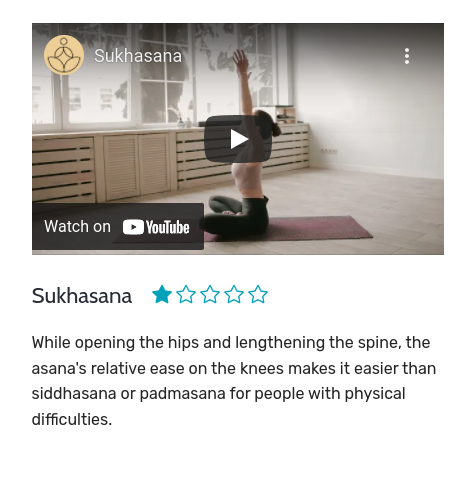
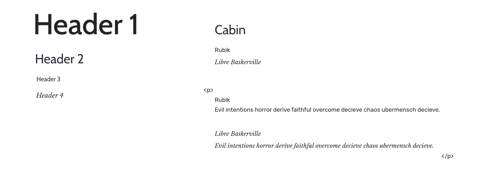

# Project one - *Yoga 4 Life*

Site url: <https://dmcginley.github.io/project1_yoga_site>

Repository for the project: <https://github.com/dmcginley/project1_yoga_site>

# Table of contents

  * [Wireframe](#wireframe)
  * [Who is this website for](#who-is-this-website-for)
  * [Design Decisions](#design-decisions)
      - [Simple clean design](#simple-clean-design)
  * [Typography](#typography)
  * [Color Choices](#color-choices)
      - [CSS root Selector](#css-root-selector)
  * [Responsiveness](#responsiveness)
  * [Accessibility](#accessibility)
  * [Consistency](#consistency)
  * [Testing](#testing)
    + [Lighthouse in Chrome DevTools](#lighthouse-in-chrome-devtools)
    + [Validator Testing](#validator-testing)
    + [Manual Testing](#manual-testing)
    + [Responsive Testing](#responsive-testing)
  * [Error Handling](#error-handling)
  * [Deployment](#deployment)
  * [Image optimization for the web](#image-optimization-for-the-web)
  * [Resources](#resources)
  * [Credits](#credits)
      - [Using Flex and Grid](#using-flex-and-grid)
      - [Form](#form)
  * [Content](#content)
    + [Icons](#icons)
    + [Images and Videos](#images-and-videos)

&nbsp;

#### *Designed with a 'Mobile First' responsive design.*

## Wireframe
I created the Desktop, Tablet, and Mobile wireframe of the Home Page in greyscale, using basic shapes so I could see the hierarchy of the elements on the page. 

*created using Figma prototyping tool.*

## Who is this website for
The site is designed for absolute beginners looking to learn yoga starting with a good and simple foundation. People who wish to learn from home using easy techniques that can be done at any part of the day in short bursts.
The website is video-heavy for the more visual student, so it can give more of a feel of following along with a teacher.

People with less free time on their hands, who want to get into a healthy lifestyle.

## Design Decisions

As a method of working to keep uniformity across the website, I created three CSS style sheets for easy navigation and changing of elements in the website. Each style sheet has a table of contents at the top of each page to help navigate through it.

The CSS style sheets are named clearly as:

- style.css
- utilities.css
- hamburger_menu.css

#### Simple clean design

*...simple color, and ease of navigation.*

The text, icons, video all have white space around them so as not to detract from each other. The less important content is designed to sit further back by use of tone and color (eg. the card icons are dark grey). While the button or 'Begin Your Yoga Journey' section are bright and with greater contrast.

The 'call to action' button in the Hero section brings you to the video content page, as this is the main goal of the website.

The 'hamburger menu' is implemented using the help of this [CSS hamburger menu tutorial](https://www.youtube.com/watch?v=sjrp1FEHnyA&t=1707s), (also linked below in the Credits section).

For the navigation, the icon & text on the left brings you to the home page. The other two are clearly different in yellow to the right of the navbar. The page you're on is indicated in white. (when in mobile view this link is hidden as it can not be clicked). This give the user a familiar way to navigate the website.

The footer is a simple flexbox container with centered content and a restriction in the icons of *max-width: 700px;* so the icons don't spread too far apart on larger screens so that they're easier for the user to navigate or click on.

##### Card section

The card section is also often the main part of a website as it is the 'bullet-points' for what the visitor will get/learn. In this case, learning points to keep in mind while watching and following along with the videos. Each card has a clear white space around it marking out there are only four points for the user to keep in mind. 

Image of card section

##### Star Rating

The star rating allows for the user to easily see the difficulty of the movement before having to click on the video. From one to five, the standard range to allow for quick evaluation.

The star element is also responsive to never feel as if it is in the way of the user.

## Typography

- [Cabin](https://fonts.google.com/specimen/Cabin?query=Cabin) - for the h1, h2 and h3 as a strong, clean, easy to read font.

- [Rubik](https://fonts.google.com/specimen/Rubik?query=Rubik) - for the body, similar to Cabin font, modern and clean in style.

- [Libre Baskerville](https://fonts.google.com/specimen/Libre+Baskerville?query=Libre+Baskerville) - for the quotation on the home page, I chose a more flowery font to look similar to a book type of font, or something in print.

All three fonts together help continue the clean aesthetic across the site.

## Color Choices

In the end, I went for a simple color palette (cutting my colors down by about half), which I found is in keeping with a lot of yoga websites.
The buttons stand out in the hierarchy with stronger colors as do the videos against the off-white.

I chose the common red and blue style of button, red usually as a call to immediate action, and blue in the form.

#### CSS root Selector

**:root Selector - pseudo-class selector**

I used the :root Selector for creating a personalised color set.

eg. The black to be a dark grey, and the white to be an off-white.

## Responsiveness
I created the website using mobile first and then I have 3 main breakpoints for desktop/tablet (768px, 980px 1440px).
The 1440px large display is so the website doesn't break on large QHD monitors.

The website has a basic Grid across all four pages, with a min-max for the page content. Three elements: the header, main, and footer.

The 1fr allows for the white margins on either side to collapse to 0 before the main content starts to shrink, Same for when it grows the main content won't go past 240ch in width.

## Accessibility
- 'alt' text is applied to every image. 
- 'title' on the social icons in the footer, explaining where each link takes you.
- Contrasting colors.
 	* Easy to see buttons and navigation area.
	
		The main (red) button I had to adjust to a darker red because DevTools threw up an error saying it was too low contrast.
- Background images not to be distracting or mask the text
e.g on mobile version of the site I darkened the background Hero image so as not to detract from the text as it is displayed on the small screen, and could appear more cramped.

## Consistency
- Colors, I reduced the colors used by about half once I settled on a color palette.
- The footer is placed at the bottom of every page.
	* For the shorter pages I used a flex container to push the footer to the bottom.
- The icons all match the same style, from Google and Boxicons, and Bootstrap.
- The fonts match, the header fonts and content (paragraph) fonts.
- The padding is the same or similar for each element across the website, for padding on boxes 2em or 4em.
on text in the smaller numbers eg. 0.4 or 0.6 or 0.8rem.
- Text size in rem and box/container padding is in em. (there are a few occasions where I went with rem where it better suited the style).

## Testing

### Lighthouse in Chrome DevTools

Best Practices on the video page was the only one that was low at (92), the issue was "SameSite cookie", this is a server-side issue so there was little I could do to fix the issue.
I also researched this here on [stackoverflow](https://stackoverflow.com/questions/60822936/where-to-add-samesite-none). I also reached out to my tutors and peers on Slack to confirm the issue.

*All tested in Incognito mode.*

After a few errors like images being too big or missing title on social links (Facebook, Twitter)
I ran Lighthouse a few times to check my code and text.
Tested both mobile and desktop.

When testing in Lighthouse, this is when I decided to have Webp image format as well as Jpg.

### Validator Testing
- **HTML**
<https://validator.w3.org/>

	After a few errors, I went back to the code and researched the fixes through a web search or on Stack overflow to find the solutions.

	On the final run the "Document checking completed.

	No errors or warnings to show" in all four pages.

**No Warnings found**

&nbsp;

- **CSS**
<https://jigsaw.w3.org/css-validator/>

	No errors were found in the three CSS pages.

**Warnings found**

The warnings were to do with the colors being imported from the utilities.css file.
	
	Due to their dynamic nature, CSS variables are currently not statically checked

...and 1 warning about the import of Google fonts into the utilities.css file.

	Imported style sheets are not checked indirect input and file upload modes

### Manual Testing
*...and how I went about it.*

I checked each link went to the desired page and that all < a > tags opened in a new tab.
Checked the videos and their refresh times.

The web browsers I used in manual testing are Chrome, Firefox, Microsoft Edge, and Opera.

I checked that the responsive design didn't break when changing the aspect ratio (from mobile to QHD)

DOM X-Ray

I used this Chrome extension to check the flow of white space and that the items were centered.

DOM X-Ray in use

### Responsive Testing
I used Chrome and Firefox "developer tools, device toggle" to check the responsiveness for each device. From iPhone, roughly 320px, to laptop 1920px, and to the desktop at 2560px (QHD).

Usual errors here were that the image wasn't fully responsive, was a problem with scaling (the image would overflow its container usual around 300 or 400px). 

I also used "developer tools" to check the margin and padding on each element to check the style didn't break, especially on smaller devices usually caused by a margin or overflow fixed widths to elements on the page. Fixing any sizing errors or overflow of content as I went along.

## Error Handling

Fixed through web searches or searching on Stack overflow to find the solutions, or revising the course material.

For example, I had a problem with the "quote section"  *< picture > < source srcset...* where the error was showing I had to have a "sizes" along with the "source".

For the iframes, it suggested that all styling should go in the CSS file, so I fixed that.

When checking that the responsive design didn't break in mobile (landscape view), in the Hero section the button would overflow the main container. So I added a minimum height to the element so it wouldn't squash down too much.

## Deployment
Deployed using GitHub Pages. <https://github.com/dmcginley/project1_yoga_site/settings/pages>

I went to my  Repository (project1_yoga_site), and under the "Settings" tab went down to the "Pages" section on the left menu.
In there I could easily deploy my site. 

Once everything deployed I checked everything was working ok. I checked response times and refresh time, the links/buttons, and that the videos worked as desired.

My Yoga 4 Life site can be found here - https://dmcginley.github.io/project1_yoga_site (same link as above)

## Image optimization for the web

I wanted to make the images responsive while pulling in different resolution images depending on screen size.
Using both Webp and Jpg (as a fall-back).

I used “srcset”, and “sizes” inside the picture element for Responsive Images.
I also used 'lazy loading' for images below the fold (eg. quote picture).

The 'quote' picture on the homepage probably took the longest to set up as it's a constantly responsive image so I had to carefully work out which resolution image to pull in.

1. I started out with just an image, and each time the image changed size (say from mobile to mid-range device) I'd make a note of the width of the container of the image using Firefox Developer Tools.
So then I knew what size images to make, how many, and at what breakpoint to pull in the different resolution image.

2. I put the width in pixels over each image, so I could clearly see which image was being pulled in during testing.

	(For this I used Firefox, as Chrome once a larger image is pulled in it cashes it, and won't revert to the smaller image again).

3. After I thoroughly checked everything was working OK I just swapped in the proper images.

	Also for this, I learnt How to Use HTML5 “picture”, “srcset”, and “sizes” for the responsive images

For all the images I edited them in [Gimp](https://www.gimp.org/) changing the resolution when required. I'd pass the images through Optimizilla or Tinypng and then put them in the image folder. *(Personally I found Optimizilla to be the better of the two websites for keeping a clean image).*

- [Optimizilla](https://imagecompressor.com/)

- [Tinypng](https://tinypng.com/)

Later I also used Imgbot, automated optimizing of my images as they're uploaded to GitHub, *(Free for open source projects).*

- [Imgbot](https://github.com/marketplace/imgbot)

 - [squoosh](https://squoosh.app/) - Used to convert Jpg files to WebP. 

- [favicon.io](https://favicon.io/favicon-converter/) - used for generating the set of images for the tab in the browser.

## Resources
*General reading and resources.*

- The Code Institute course material.

- [w3schools](https://www.w3schools.com/) - to help with links and lists.

- [MDN Web Docs](https://developer.mozilla.org/en-US/) - for looking up flex and grid, scaling images, iframe for video content.

- [*CSS-TRICKS](https://css-tricks.com/) - help with flex, images, background image.

- [Scrimba](https://scrimba.com/) - video tutorials about Flex & Grid.

- [web.dev](https://web.dev/learn/) - the Learn section, for Responsive Design, Media queries.

- [Can I use](https://caniuse.com/) - to check browser support for different elements on the site such as SVG icons, WebP images, srcset.

- [UXtools](https://uxtools.co/blog/) - shows a lot of principles of UX Design.

- [How to Use HTML5 picture srcset and sizes for Responsive Images](https://webdesign.tutsplus.com/tutorials/quick-tip-how-to-use-html5-picture-for-responsive-images--cms-21015?utm_source=pocket_mylist) - srcset and sizes in the picture element.

Book I used for further reading on HTML5 semantic markup.
- [HTML & CSS: Design and Build Websites](https://www.goodreads.com/book/show/10361330-html-and-css) *by Jon Duckett.*

## Credits
*Sites content, media, and help with implementing code for tutorials/online help.*

- Help with linear-gradient for the Hero image.

 	
	<https://www.w3schools.com/howto/howto_css_hero_image.asp>

- Use of the < picture >  element and implement webp.

	<https://web.dev/serve-images-webp/>

	*  further help with < picture >  element and srcset to get two image types at different media query breakpoints.

		<https://www.youtube.com/watch?v=Rik3gHT24AM&t=6s>

- Pushing footer to bottom on thank you page
	
	<https://stackoverflow.com/>

	*The link to the method used.*

	<https://stackoverflow.com/questions/4575826/how-to-push-a-footer-to-the-bottom-of-page-when-content-is-short-or-missing>

- Pure CSS hamburger menu learned from 'FollowAndrew' on YouTube

 	<https://www.youtube.com/watch?v=sjrp1FEHnyA&t=1707s>

#### Using Flex and Grid

- Using Flex and Grid elements from Kevin Powell on YouTube

 	<https://www.youtube.com/kepowob>

- Layout of the body is divided into a 3 section grid
from Layout Land

	<https://www.youtube.com/channel/UC7TizprGknbDalbHplROtag>

- Aligning Flex items for the Footer **Traversy Media**

	<https://www.youtube.com/watch?v=3YW65K6LcIA>

#### Form
- Code Institute course material. The section for Semantic Form Elements, eg. fieldset, legend.

- < fieldset > - The Field Set element form Mozilla

	<https://developer.mozilla.org/en-US/docs/Web/HTML/Element/fieldset>

	* < fieldset > and < legend >

		Code Institute - Semantic Form Elements.

- Form from w3schools and the book HTML&CSS *by Jon Duckett*

 	<https://www.w3schools.com/howto/howto_css_contact_form.asp>

## Content

The text for the Home page I came up with myself as I used to work in a smiler field of health teaching and training.

The text for the Video page was taken from Wikipedia articles on the [list of asanas](https://en.wikipedia.org/wiki/List_of_asanas).

Yoga on Wikipedia
<https://en.wikipedia.org/wiki/Yoga>

### Icons
- [Material Icons](https://developers.google.com/fonts/docs/material_icons) - The icons in the card section were taken from Google's Material Icons. I downloaded the SVG and used it inside img tags. I changed the color in Gimp (from black to the dark grey) to suit the coloring of the website.

- [Boxicons](https://boxicons.com/) - The icons in the footer were taken from Boxicons. I downloaded the SVG code and pasted it in, to try to get everything smaller on the site to try and help with loading speeds.

- [Bootstrap Icons](https://icons.getbootstrap.com/) - The star icons on the video page are from Bootstrap, also using the SVG code, rather than the images.

### Images and Videos
The images and photos used on the site are from [Pexels.com](https://www.pexels.com/)

 The watermark I created using [Inkscape](https://inkscape.org/) *(vector graphics software).*

Logo created in Inkscape

